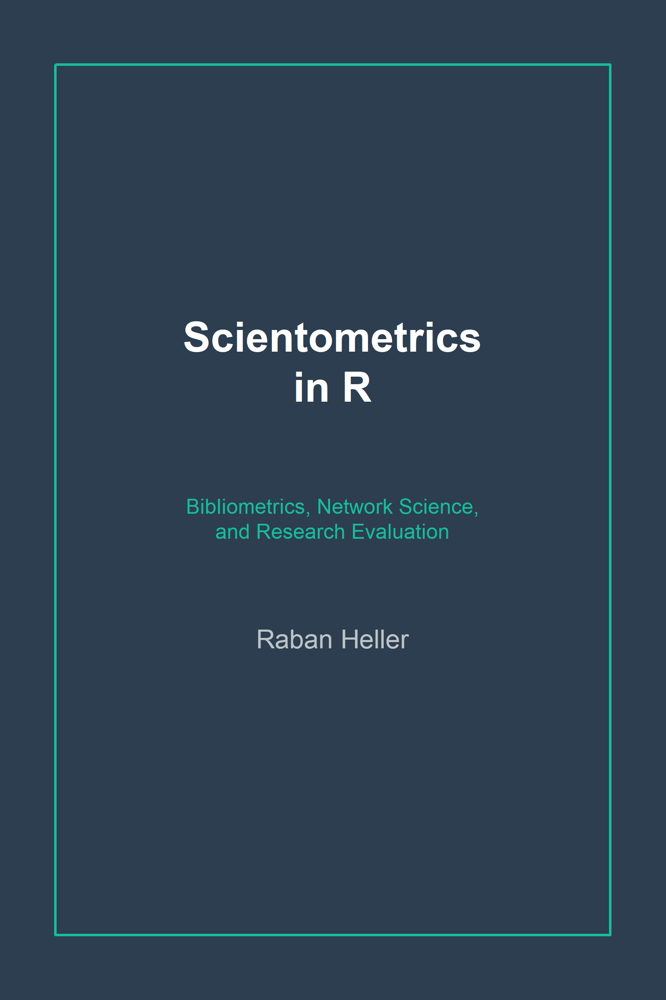

```{r common-setup, include=FALSE}
source("_common.R")
```

# Welcome! {-}

---

<a href="https://github.com/r-heller/scientometrics-in-r" target="_blank"></a> Welcome to **"Scientometrics in R: Bibliometrics, Network Science, and Research Evaluation"**.

This is a working guide to scientometrics in R for researchers, librarians, research administrators, and data scientists who want to study scholarly communication quantitatively. It walks the full pipeline --- from pulling records out of OpenAlex, Crossref, and PubMed, through computing the standard indicators (h-index, MNCS, journal metrics), to building co-authorship and co-citation networks, applying text and topic models to scientific corpora, and packaging the results into reproducible reports and dashboards.

The book assumes a working knowledge of R at the tidyverse level and basic statistics. No prior scientometric experience is needed --- the early chapters lay the conceptual and ethical foundations, and each later chapter starts with a concrete research question and ends with a callout on responsible use grounded in the Leiden Manifesto and DORA.

All examples run against free, open data; no Web of Science or Scopus subscription is required. Small sample datasets ship with the companion R package `scientometricsInR`; everything else is fetched live from public APIs. The book does *not* cover proprietary platforms (InCites, SciVal), manual screening workflows for systematic reviews, or qualitative sociology of science.

<br></br>

## Open Source Repository {-}

---

This book has been built using [**{rmarkdown}**](https://rmarkdown.rstudio.com/docs/) and [**{bookdown}**](https://bookdown.org/). Formulas are rendered using [MathJax](http://docs.mathjax.org/en/latest/index.html). All source files are available on **GitHub** at <https://github.com/r-heller/scientometrics-in-r>. You are free to fork, share, and reuse contents under the project's [CC BY-SA 4.0 license](LICENSE).

<br></br>

## How To Use The Guide {-}

---

- **Linear or lookup.** Read front to back, or use the *Find Your Method* navigator (Chapter \@ref(find-your-method)) to jump to the chapter that answers your question.
- **Code.** Reusable helpers live in the companion R package `scientometricsInR` and in `R/` in the source repository; every chapter shows the full chunk it depends on.
- **Per-chapter PDFs.** Each chapter page has a *Download this chapter (PDF)* button at the top right.
- **Whole-book downloads.** Use the *Download* menu in the top navigation bar for PDF and EPUB.
- **Corrections.** Please file an issue at <https://github.com/r-heller/scientometrics-in-r/issues>.

<br></br>

## Contributing {-}

---

Pull requests, corrections, and additions are welcome. See [`CONTRIBUTING.md`](https://github.com/r-heller/scientometrics-in-r/blob/main/CONTRIBUTING.md) for the workflow. <!-- TODO: external contributors will be listed here. -->

<br></br>

## Citing this Guide {-}

---

The suggested citation is:

```{block, type='boxempty'}
**Heller, R.** (2026). *Scientometrics in R: Bibliometrics, Network Science, and Research Evaluation* (Version 0.1.0). Self-published via GitHub Pages. <https://r-heller.github.io/scientometrics-in-r/>.
```

Download the reference as [BibTeX](citation-files/citation.bib) or [.ris](citation-files/citation.ris).

<br></br>
